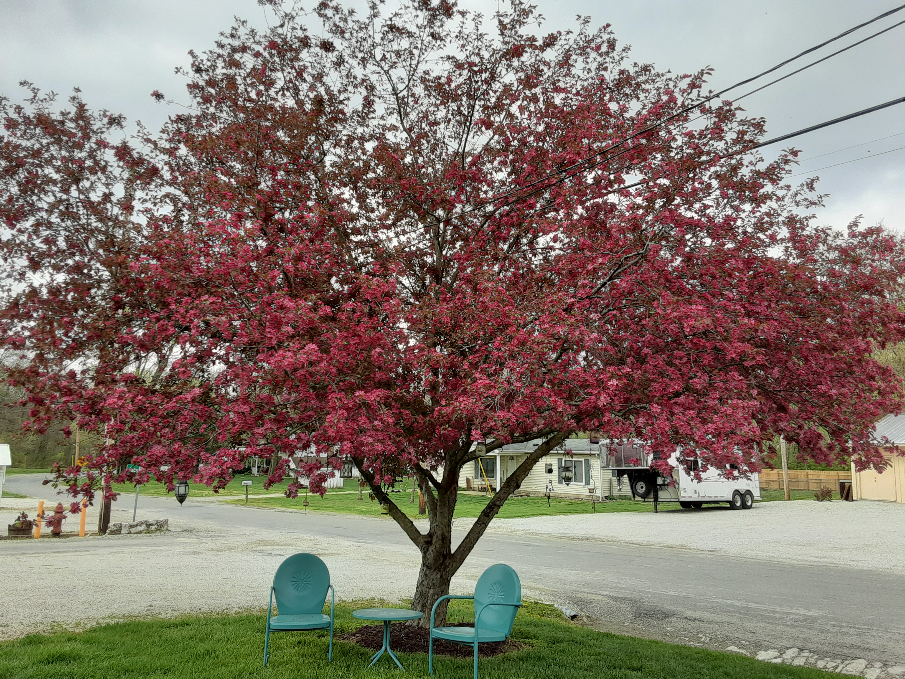

# Portfolio

This repo has code for Aubrey's Professional Portfolio.
Info includes:

1. About Me section
2. Works with links to deployed repos
3. Contact information

# Link to deployed webpage:
1. https://lennylettuce.github.io/Portfolio/

## Link to cited sources:
1. https://github.com/Lennylettuce/Horiseon - code from past assignment
2. https://developer.mozilla.org/en-US/ -for syntax, rules
3. https://git.bootcampcontent.com/Washington-University-in-St.-Louis/WUSTL-VIRT-FSF-PT-01-2023-U-LOLC - ref classwork code